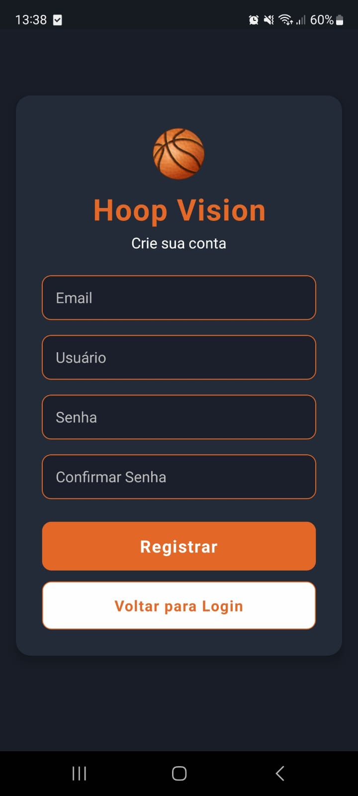
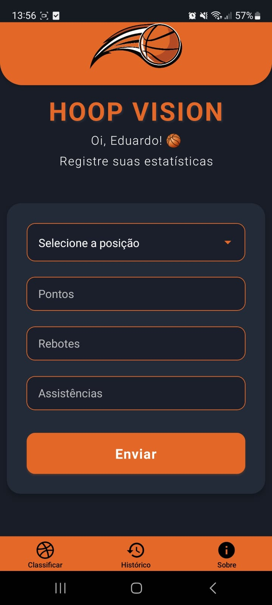
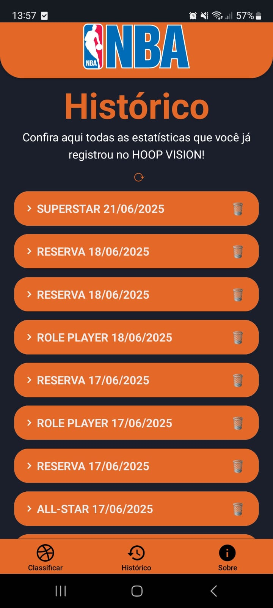
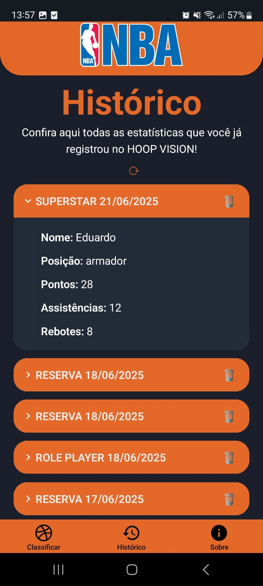
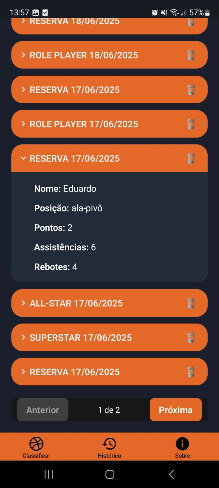
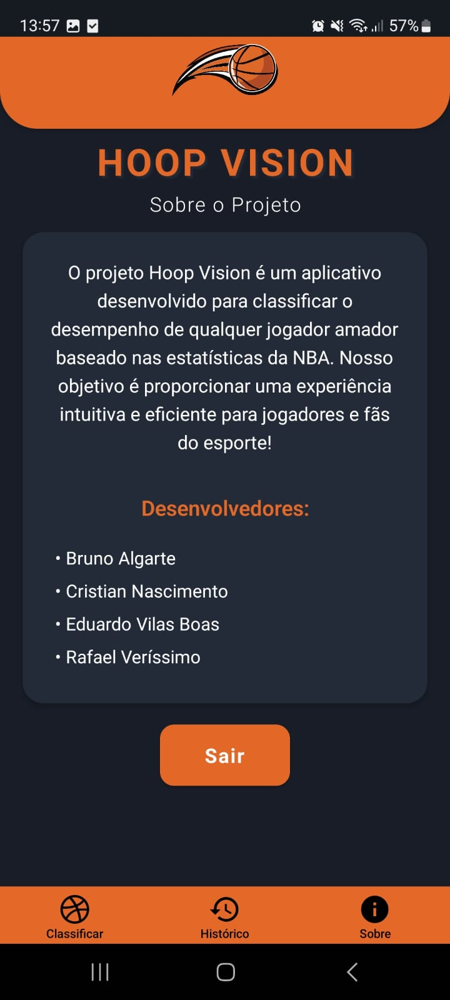

# 🏀 Hoop Vision — Projeto Interdisciplinar 5º Semestre DSM

O projeto **Hoop Vision** é um aplicativo mobile desenvolvido com foco em jogadores de basquete. Ele permite que os usuários insiram suas estatísticas de desempenho (como pontos, assistências e rebotes), e utiliza inteligência artificial para classificá-los em perfis como **Reserva**,**Role** **Player**, **All-Star** ou **Superstar**.

O objetivo principal é oferecer uma ferramenta interativa e educativa, que ajude atletas a entenderem seu nível atual e acompanharem sua evolução — tudo de forma simples, intuitiva e com base em dados reais.

## 👥 Integrantes do Projeto

- [Bruno Algarte Inácio](https://github.com/BrunoAlgarte)
- [Cristian Tulio Garcia Do Nascimento](https://github.com/seu-usuario)
- [Eduardo Vilas Boas Freitas](https://github.com/EduardoVBF)
- [Rafael Verrísimo da Silva](https://github.com/F43LS1LV4)

---

## 📱 Frontend (Mobile)

O front-end é uma aplicação mobile desenvolvida com **React Native + Expo SDK 52**.

### 🚀 Tecnologias utilizadas

- React Native
- Expo SDK 52

### 📺 Telas da aplicação


#### 🏠 Tela Inicial


#### 🏀 Tela de Classificação


#### 📊 Tela de Histórico


#### 👤 Tela de Histórico 2


#### ⚙️ Tela de Histórico 3


#### 🔍 Tela de Detalhes



### 📦 Instalação e execução

> ⚠️ **Importante:** A versão do **Expo Go deve ser 52**. A versão disponível na loja pode ser incompatível.

#### 1. Baixar o APK do Expo Go (SDK 52)
[Baixar APK Expo Go SDK 52](https://expo.dev/go?sdkVersion=52&platform=android&device=true)

> Em alguns dispositivos, pode ser necessário liberar a instalação de apps fora da Play Store.

#### 2. Clonar o projeto

```bash
git clone https://github.com/RafaelVSs/DESM-P5-G03-2025-1.git
cd DESM-P5-G03-2025-1/mobileFront
```

#### 3. Instalar dependências

```bash
npm install
```

#### 4. Iniciar o servidor do Expo

```bash
npx expo start --clear
```

#### 5. Escanear o QR Code

Use o app **Expo Go (versão 52)** para escanear o QR Code que aparecerá no terminal.

---

## 🧠 Inteligência Artificial (Classificação de Jogadores)

A IA do projeto **Hoop Vision** tem como objetivo classificar jogadores de basquete com base em suas estatísticas, identificando se eles possuem ou não o perfil de **"Superstar"**.

### 🎯 Objetivo

Criar um modelo de aprendizado supervisionado que, ao receber estatísticas de desempenho de um jogador da NBA, retorne se o jogador é ou não considerado um "Superstar", com base em dados históricos e rótulos previamente definidos.

---

### 🗂️ Etapas realizadas

#### 1. **Pré-processamento dos dados**
- Fonte: Dataset com estatísticas de jogadores da NBA (pontos, assistências, rebotes, minutos jogados, etc.).
- Tratamento de valores faltantes e remoção de colunas irrelevantes.
- Normalização dos atributos numéricos.
- Codificação da classe alvo como binária: `superstar = sim` ou `não`.

#### 2. **Treinamento e Avaliação**
Testamos diversos algoritmos no software **Weka**, utilizando **validação cruzada (10 folds)** para garantir confiabilidade na avaliação dos modelos.

| Algoritmo             | Acurácia | Precision (Superstar) | Recall (Superstar) |
|-----------------------|----------|------------------------|---------------------|
| ✅ **Random Forest**   | 99%      | 0.90                   | 0.79                |
| 🤖 SVM                | 97%      | 0.94                   | 0.67                |
| 📈 Regressão Logística| 96%      | 0.88                   | 0.58                |
| 🌳 Árvore de Decisão  | 97%      | 0.91                   | 0.88                |
| 🚫 Naive Bayes        | 32%      | -                      | -                   |

🔍 **Modelo escolhido:** Random Forest – por apresentar alta acurácia, boa performance geral e robustez contra overfitting.

---

#### 3. **Exportação do modelo**
O modelo final foi exportado em formato `.model` do Weka e armazenado na aplicação para testes e futuras integrações com o front-end.

#### 4. **Integração com a API**
- A classificação não foi integrada em tempo real, mas foi testada localmente.
- O back-end está preparado para receber inputs de estatísticas e enviar para o classificador.
- Possibilidade futura de usar bibliotecas como `scikit-learn` para reimplementação em Python e integração nativa com o FastAPI.

---

## 🖥️ Backend (API)

### 🔧 Tecnologias:

- FastAPI
- Python 3.12
- Uvicorn
- PostgreSQL

### 📁 Estrutura da API

- CRUD de usuários
- Consulta ao classificador IA
- Consulta de estatísticas
- Autenticação com JWT

### ▶️ Como rodar localmente

1. Clonar o projeto:

```bash
git clone https://github.com/RafaelVSs/pi-5-semestre.git
cd pi-5-semestre
```

2. Criar ambiente virtual:

```bash
python3 -m venv venv
source venv/bin/activate
```

3. Instalar dependências:

```bash
pip install -r requirements.txt
```

4. Criar arquivo `.env` com base no `.env.example`:

```env
PROJECT_NAME="Hoop Vision"
API_V1_STR="/api/v1"
SECRET_KEY="sua_chave_secreta"
ALGORITHM="HS256"
ACCESS_TOKEN_EXPIRE_MINUTES=30
POSTGRES_DB="db_hooop_vision"
POSTGRES_USER="hoop-vision-db"
POSTGRES_PASSWORD="sua_senha"
DB_HOST="localhost"
DB_PORT="5432"
```

5. Iniciar o servidor:

```bash
uvicorn app.main:app --host 0.0.0.0 --port 8000 --reload
```

Acesse a documentação interativa em:  
👉 `http://localhost:8000/docs`

---

## ☁️ Deploy na Azure (VM)

Todo o back-end foi implantado em uma **máquina virtual Linux Ubuntu na Azure**.

### Etapas realizadas:

- ✅ Instalação do PostgreSQL
- ✅ Criação do banco e usuário
- ✅ Criação de ambiente virtual com dependências
- ✅ Criação do serviço `hoopvision.service` com Systemd
- ✅ Liberação da porta 8000 no grupo de segurança da Azure
- ✅ Configuração de DNS personalizado:

URL de acesso externo:  
🌐 [`http://hoopvision.eastus2.cloudapp.azure.com:8000`](http://hoopvision.eastus2.cloudapp.azure.com:8000)

### Comando para status do serviço:

```bash
sudo systemctl status hoopvision.service
```

---

## 📦 Banco de Dados

- PostgreSQL 15
- Database: `db_hooop_vision`
- Usuário: `hoop-vision-db`
- Schema público utilizado para as tabelas

---

## 💻 Vídeo Pitch!

➡️ [Clique aqui para assistir no YouTube](https://youtu.be/1GOXcnqKarY)


---

## 📄 Licença

Este projeto é acadêmico e foi desenvolvido como parte do Projeto Interdisciplinar do 5º semestre do curso de DSM – Fatec Franca.

---
